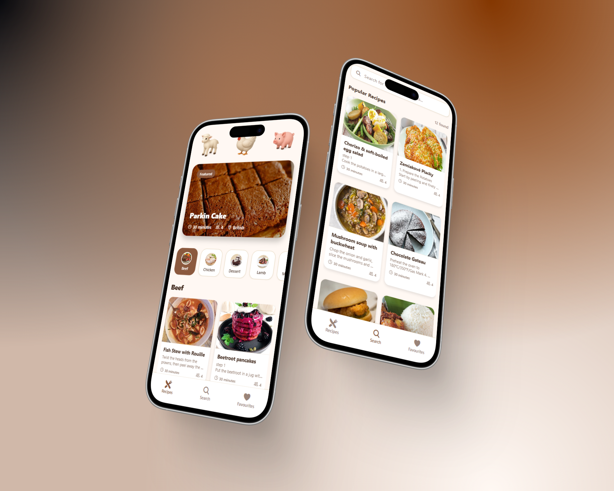

<div align="center">

<a href="https://github.com/terzievdimitar/react-native-recepie-app" target="blank">
   
</a>

<h2>Recipe App – React Native (Expo)</h2>




</div>

## 💡 Overview

**Recipe App** is a cross-platform mobile application built with React Native and Expo. It allows users to:

- Browse and search for recipes
- View detailed recipe information
- Save favorite recipes
- Authenticate and manage their account

The backend is powered by Node.js, Express, and Drizzle ORM, providing a robust API for recipe data and user management.

## ✨ Features

- **🔐 Authentication**

     - Email/password sign up and login
     - Secure session management with Clerk

- **🍲 Recipe Search & Browse**

     - Search recipes by keyword
     - Filter by category
     - View recipe details, ingredients, and instructions

- **⭐ Favorites**

     - Save and manage favorite recipes
     - View a personalized favorites list

- **⚡ Fast & Responsive UI**
     - Built with Expo and React Native
     - Optimized for both Android and iOS

## 👩‍💻 Tech Stack

**Mobile**

- React Native (Expo)
- JavaScript
- Expo Router
- Custom Hooks

**Backend**

- Node.js + Express
- Drizzle ORM (with NeonDB - PostgreSQL)
- REST API

## 📦 Getting Started

To run the app locally:

### 🚀 Prerequisites

- **Node.js** (v18+ recommended)
- **npm** or **yarn**
- (Optional) Android Studio or Xcode or Expo GO for emulators

### 🛠️ Installation

1. **Clone the repository**

      ```bash
      git clone https://github.com/terzievdimitar/react-native-recepie-app.git
      cd react-native-recepie-app
      ```

2. **Install dependencies:**

      ```bash
      cd mobile && npm install
      cd ../backend && npm install
      ```

3. **Set up environment variables:**

      Create a `.env` file in `/backend` and add your database and secret keys as follows:

      ```env
      PORT=5001

      # Database URL
      DB_URL=

      API_URL=

      # Clerk API Keys
      EXPO_PUBLIC_CLERK_PUBLISHABLE_KEY=

      NODE_ENV=
      ```

      Create a `.env` file in `/frontend` and add your database and secret keys as follows:

      ```env
      EXPO_PUBLIC_CLERK_PUBLISHABLE_KEY=pk_test_dmlhYmxlLXRvcnRvaXNlLTYuY2xlcmsuYWNjb3VudHMuZGV2JA
      ```

4. **Run the development servers:**

      ```bash
      # In one terminal
      cd backend && npm run dev

      # In another terminal
      cd mobile && npx expo start
      ```

## 📖 Usage

### ✔ Running the App

- **Development mode:** `npx expo start` (from the `mobile` directory)
- **Production mode:** `npx expo start --no-dev --minify`

> Use the Expo QR code to open the app on your device, or run it in an emulator.

### 📃 API Overview

The backend provides RESTful endpoints for authentication, recipes, and favorites. See `backend/src/server.js` for route setup.

#### **Authentication**

- Auth is done using Clerk. For more information visit [https://clerk.com/docs/expo/getting-started/quickstart](https://clerk.com/docs/expo/getting-started/quickstart)

#### **Recipes**

- To manage the recipe TheMealDB API has been used. For more information visit [https://www.themealdb.com/api.php](https://www.themealdb.com/api.php)

#### **Favorites**

- `POST /api/favorites` – add a recipe to favorites
- `GET /api/favorites/:userId` – list user’s favorite recipes
- `DELETE /api/favorites/:userId/:recipeId` – remove a recipe from favorites

## 📜 License

Distributed under the MIT License. See [License](/LICENSE) for more information.
